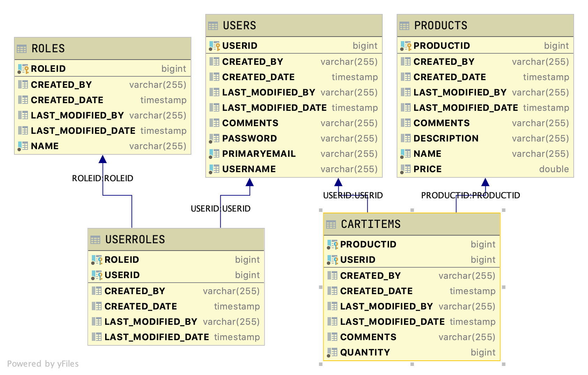

# Project Shopping Cart

A Student that completes this project shows they can:

* understand the flow and implementation of Spring Security and OAuth2 to provide authentication for a project
* read user information from the access token
* understand the issues related to CORS and implement solutions to those issues
* understand how to implement a new user and logout endpoints
* use Postman to manually test Web APIs using Authentication

## Introduction

A shopping cart is a very common application so let's look at one. This Java Spring REST API application will provide endpoints for clients to perform the various CRUD operations on data sets contained in the application's data. Access to these endpoints will be secured using OAuth2 Authentication.

### Database layout

You are creating a Java Spring REST API server which stores data in an H2 database. The final table layout should be

All tables contain the following auditing fields

* created_by - user name who created the row. Should default to SYSTEM
* created_date - date field when the row was created
* last_modified_by - user name who last changed data in the row. Should default to SYSTEM
* last_modified_date - date field when the data in the row was last changed

Table Relationships include

* Users is the driving table and can be thought of as "Customers".
* Users have a Many to Many relationship with Products. One user can have many products in their "shopping cart" while a product may appear in many different users "shopping cart".
* A shopping cart is the collection of relationships between a user and product and is modeled using the join table CartItems which contains the quantity of the product being ordered.
* Users have a Many to Many relationship with Roles. A user can have many roles while many users can have the same role.

You are to start with the initial application provided. To find out the endpoints available to you in the initial application, you will need to use the Swagger document. Remember the Swagger documentation can be access at [http://localhost:2019/swagger-ui.html](http://localhost:2019/swagger-ui.html) once the application is running.

## Instructions

* [ ] Please fork and clone this repository.
* [ ] This repository does have a starter project, so you must start with that application inside of the cloned repository folder. Regularly commit and push your code as appropriate.
* [ ] A data.sql file has been provided with seed data. You can use this class directly or modify it to fit your models. However, the data found in the file is the seed data to use!
* [ ] Note that all of the users' passwords are "LambdaLlama".
* [ ] Note that For the final project, passwords in the data.sql file will need to be converted to BCrypt! To convert Bcrypt, you can use the website [https://bcrypt-generator.com/](https://bcrypt-generator.com/). Once you have the BCrypt string, you will replace LambdaLlama with that BCrypt string.

### MVP

* [ ] Add OAuth2 Security to the application
  * [ ] Add the necessary dependencies
  * [ ] Update User model as appropriate
  * [ ] Add findByName to the User Service with associated repository entry
  * [ ] Add the necessary helper functions
  * [ ] Add the SecurityUserService service
  * [ ] Add and update the necessary configuration files
* [ ] The initial endpoints are affected by security as follows
  * [ ] Only admins can access routes /roles/**
  * [ ] Only admins can access routes /products/**
  * [ ] Only admins can access routes
    * [ ] POST /users/user
    * [ ] DELETE /users/user/{id}
    * [ ] PUT /users/user/{id}
    * [ ] GET /users/user/name/{userName}
    * [ ] GET /users/user/name/like/{userName}
    * [ ] GET /users/user
  * [ ] For the following routes, admins can access them and a user can access only their own data
    * [ ] PATCH /users/user/{id}
    * [ ] GET /users/user/{userId}
  * [ ] For the routes /carts/**
    * [ ] Remove the user/{userid} path variable from all the routes
    * [ ] Use the authenticated as the user to work with
* [ ] Add new endpoints
  * [ ] http://localhost:2019/users/myinfo
    * [ ] Any authenticated user can access this endpoint and it will return the authenticated users information
  * [ ] http://localhost:2019/logout
    * [ ] Allows a user to logout of the system by removing their access token from the token store
  * [ ] Address CORS

### Stretch Goals

* [ ] When working with Cart Items, give the client the option of sending a comment
